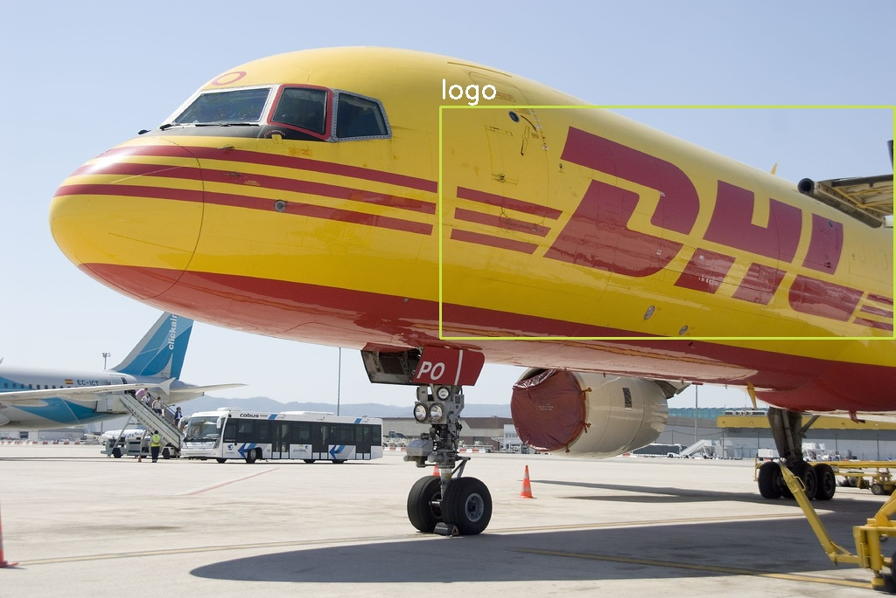

# Visualize and Process YOLO format data

## How to run

### Visualize data

``` bash
pip install opencv-python
python visualize.py --datadir ./data/images/ --classes classes.txt --savename output --number 1 --random
```

### Count labels

``` bash
python count_labels.py --label_dirs /path/to/a/labels /path/to/b/labels --classes /path/to/classes.txt
```

## Demo

| In | Out |
| --- | --- |
|  |  |